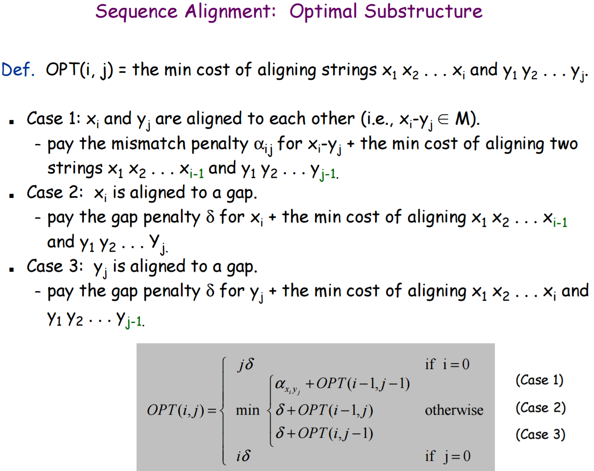
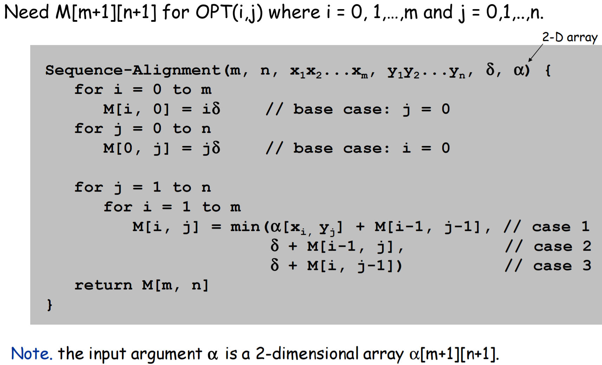
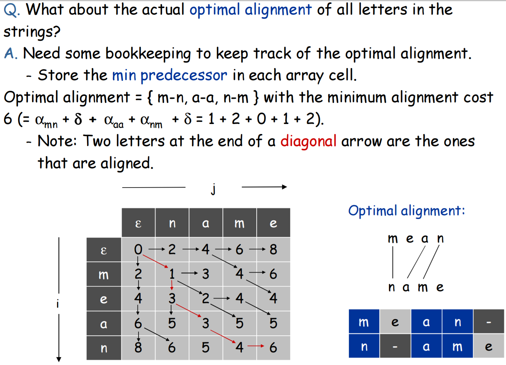

# Sequence Alignment
Implementation of the classic **Dynamic Programming** problem. Applications include Unix `diff`, DNA sequence matching, "did you mean" search suggestions

## Problem Statement 
Given 2 sequences, find the minimum cost of aligning the 2 sequences  
Gaps can be inserted to 1 sequence or the other, but not at the same time  
`2` = **Gap Penalty (δ)**  
If 2 characters are aligned with each other, there may be a **mismatch penalty (αi j)**
 - `0` = aligning identical letters
 - `1` = aligning a vowel with a vowel, or a consonant with a consonant
 - `3` = aligning a vowel with a consonant

**Minimum cost =** sum of mismatch & gap penalties (the optimal alignment)

## Optimal Substructure

## Runtime
**O(M*N)**  
Storage: also O(M*N) which requires a large 2D array

## Pseudocode

## Usage
### Requirements & Caveats
- **Letters only** (no spaces, numbers or special characters)
- `_` (*Underscore character*) is reserved to represent
- View results in a fixed-width font for the 2 sequences to be lined up
- Leading & trailing whitespace is trimmed
- **Uppercase / Lowercase is ignored** (all converted to lowercase)
- `predecessorIndexes` is calculated when creating `memoTable` but not used to find the actual alignment, only to show where the values in `memoTable` came from
 - For example: if `predecessorIndexes[4][4]` contained the array `[4, 3]`, it means the value of `memoTable[4][4]` (which is `6`) came from `memoTable[4][3]` (i.e. `case3`, `seq2` with a gap so it came from the left)
 - `predecessorIndexes[0][0]` contains the array `[-1, -1]` because the upper left corner has no predecessor, it was the initial base case

### Setup
- Provide 2 strings (edit `testSequences` 2D array)
- Optionally change the `GAP_PENALTY` and the mismatch penalties  
Currently `VOWEL_VOWEL_PENALTY` and `CONSONANT_CONSONANT_PENALTY` are the same, but are arbitrary

### Example: aligning "mean" with "name"

## Code Notes
- `findAlignment()` should only be called from inside `calcOptimalAlignment()` because it uses `memoTable` & the 2 sequences to display the actual alignment
- `seq1` & `seq2` have a leading space added (this is after trimming any trailing/leading whitespace)  
This is so that `seq1.charAt(i)` & `seq2.charAt(j)` work in the loops & the string indexes match up  
It causes some adjustments for the array sizes. 
 - `memoTable = new int[seq1.length()][seq2.length()]` uses the exact value of `length()` which includes the space
 - Loops like `for(int i=0; i<seq1.length(); i++)` use `<seq1.length()` to not go out of bounds of the string indexes
 - In `findAlignment()`, `int i = seq1.length()-1;` & `int j = seq2.length()-1;` since the 2 sequences have leading spaces & arrays are indexes from `0`
- `findAlignment()` basically retraces each calculation in the `memoTable` to see where it came from  
**There may be multiple optimal paths, but this only finds `1` of them**

## References
- [String Alignment using Dynamic Programming - Gina M. Cannarozzi](http://www.biorecipes.com/DynProgBasic/code.html) to retrace the memo table & find the alignment
